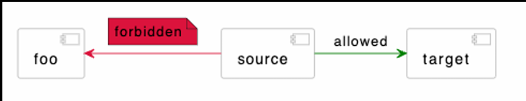
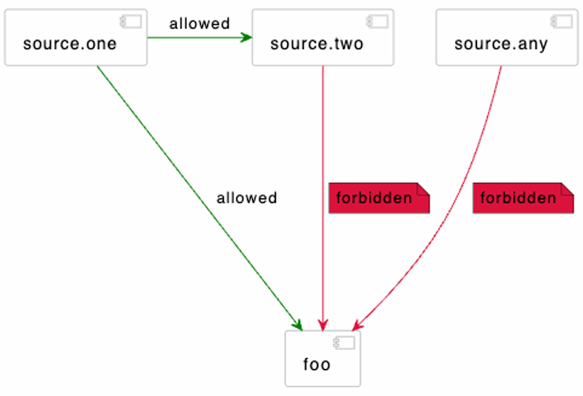
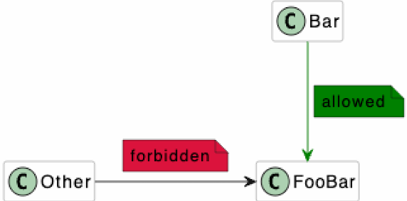

# ArchUnit
## 라이브러리 
`testImplementation("com.tngtech.archunit:archunit-junit5:1.4.1 ")`


- 자바 아키텍처를 검증하는 단위 테스트 도구
- 테스트 코드에 아키텍처 규칙을 선언하고
- 지정된 패키지, 클래스, 레이어 슬라이스 사이의 의존관계가 이 규칙에 맞는지 확인한다.
  - 계층형 아키텍처의 의존관계
  - 패키지와 클래스의 복잡한 순환 이존성
  - 클래스나 메서드 이름의 형식
  - 애노테이션의 적용 패턴
  - 의존관계와 사용관계를 구분해서 검증

1. 패키지 단위의 의존관계 검증 - 1<br>

```java
    noClasses().that().resideInAPackage("..source..")   // "source안에 있는 패키지들은
    .should().dependOnClassesThat().resideInAPackage("..foo..") // foo 패키지에 의존해서는 (no)안된다.
```
- source패키지는 
  - target 패키지를 의존해도 되지만,
  - foo 패키지를 의존해서는 안된다.

2. 패키지 단위의 의존관계 검증 - 2 <br>


```java
    classes().that().resideInAPackage("..foo..")    // foo 패키지에 있는 클래스들은
    .should().OnlyhaveDependentClassesThat()        // 나를 사용하거나 참조하는 것들이 있어야하는데
    .resideInAnyPackage("..source.one..", "..foo..")    // source.one 패키지나 foo 패키지에 있는 클래스만 의존해야한다.
```

3. 클래스 단위 <br>

```java
    classes().that().haveNameMatching(".*Bar")  // 네이밍패턴 사용가능
    .should().onlyHaveDependentClassesThat().haveSimpleName("Bar")   // Bar로 끝나는 클래스들은 Bar라는 이름의 클래스에만 의존해야한다.
```

4. 애노테이션 단위 <br>

```java
  classes().that().areAssignableTo(EntityManager.class) // EntityManager 클래스를 구현한 클래스는
    .should().onlyHaveDependentClassesThat().areAnnotatedWith(Transactional.class) // Transactional 애노테이션이 붙은 클래스에만 의존해야한다.
```

5. 계층 의존관계 확인 <br>

```java
layeredArchitecture()
    .consideringAllDependencies()
    .layer("Controller").definedBy("..controller..")  // controller 패키지에 있는 클래스는 Controller 레이어
    .layer("Service").definedBy("..service..")        // service 패키지에 있는 클래스는 Service 레이어
    .layer("Persistence").definedBy("..persistence..")  // repository 패키지에 있는 클래스는 Repository 레이어
    .whereLayer("Controller").mayNotBeAccessedByAnyLayer()  // Controller 레이어는 어떤 레이어에서도 참조되면 안된다.
    .whereLayer("Service").mayOnlyBeAccessedByLayers("Controller")  // Service 레이어는 Controller 레이어에서만 참조되어야한다.
    .whereLayer("Persistence").mayOnlyBeAccessedByLayers("Service")  // Persistence 레이어는 Service 레이어에서만 참조되어야한다.
```
- 15:34 - 학습테스트 이후 적용해볼것 